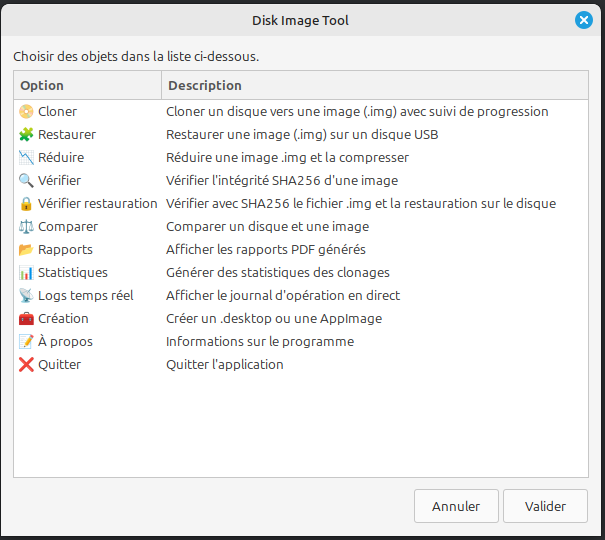

# Disk Tool Zenity



**Disk Tool Zenity** est un outil graphique tout-en-un pour gérer les images disques sur Linux. Il permet de cloner, restaurer, réduire et vérifier l'intégrité des disques avec une interface intuitive basée sur Zenity.

## ✨ Fonctionnalités

- Clonage de disque vers fichier image `.img`
- Restauration d’image `.img` vers un disque
- Réduction automatique de la taille d’une image disque
- Compression `.img.gz` avec évaluation du gain
- Vérification SHA256 des images
- Génération de rapports PDF
- Affichage temps réel des logs
- Graphique des opérations de clonage (gnuplot)
- Interface simple via Zenity

## 📦 Dépendances

Le script vérifie automatiquement et installe (via `apt`) les outils suivants :

```bash
lsblk dd losetup mount umount parted fdisk truncate grep awk xargs sudo zenity gzip sha256sum cmp enscript ps2pdf xdg-open gnuplot tail appimagetool
```

## 🚀 Utilisation

```bash
chmod +x disk-tool.sh
./disk-tool.sh
```

## 📸 Capture d'écran

*(Ajoutez une capture si nécessaire dans le fichier `screenshot.png`)*

## 📄 Licence

MIT - Utilisation libre à condition de conserver les mentions d’auteur.

---
© 2024 - Script créé par Mandream56
